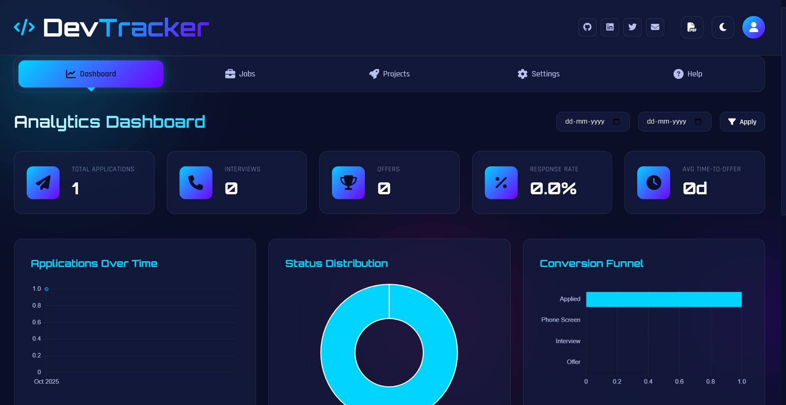
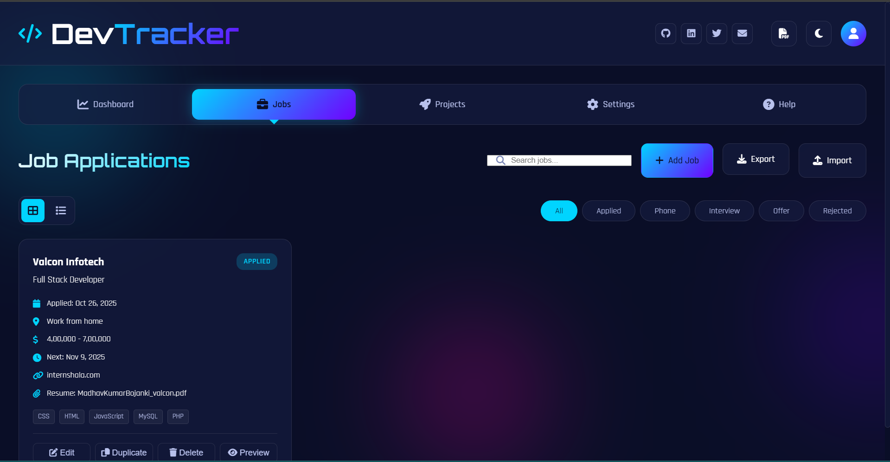

# DevTracker - Job Tracking Dashboard

A modern, futuristic single-page job tracking and portfolio website for developers. Built with vanilla HTML, CSS, and JavaScript with glassmorphism UI, dark theme, and full offline support.


## 🖼️ Screenshots

> Place the images at `assets/screenshots/dashboard.png` and `assets/screenshots/jobs.png` (filenames can be changed, but update the paths below).





## ✨ Features

### 📊 Analytics Dashboard
- **Real-time KPIs**: Total applications, interviews, offers, response rate, average time-to-offer
- **Interactive Charts**:
  - Applications over time (line chart)
  - Status distribution (donut chart)
  - Conversion funnel (bar chart)
  - Tags breakdown (horizontal bar)
  - Top companies table
- Date range filters

### 💼 Job Application Tracker
- **Full CRUD Operations**: Add, edit, duplicate, and delete job applications
- **Comprehensive Fields**:
  - Company, Role/Title, Applied Date, Status, Stage
  - Source, Location, Salary
  - Contact Person, Contact Email
    - Application URL (site used to apply)
    - Resume (per-job)
  - Notes, Tags, Next Action Date
- **Smart Filtering**: Search, status filters, date range
- **Multiple Views**: Card view and list view
- **Details Modal**: Click a job card (or press Enter) to view full details including links, notes, tags, and an inline resume preview
- **Local Storage**: All data stored in browser (localStorage for JSON; IndexedDB via localForage for global and per‑job resumes)

### 🚀 Portfolio & Projects
- Showcase personal and job-related projects
- Tech stack tags, links, images
- Filter by project type

### 📥 Export & Import
- **Export Formats**:
  - Excel (.xlsx) - via SheetJS
  - Word (.docx) - via docx library
  - CSV
  - JSON (full backup)
- 
- **What gets exported**:
    - All job fields including Application URL
    - Resume columns: "Resume Attached" (Yes/No) and "Resume Name"
- **Import**: Excel and JSON import with validation
    - Excel import recognizes the "Application URL" column

### 📄 Resume Management
Two ways to manage resumes:

1) Global Resume
- Upload a primary resume (PDF/DOC/DOCX)
- Quick access: download/open from the header or Settings
- Stored in IndexedDB

2) Per‑Job Resume
- Attach a role‑specific resume in the Add/Edit Job modal
- Preview inline in a modal (PDF or supported formats), or open in a new tab
- Delete attachment from the job if no longer needed
- Stored as a separate file in IndexedDB; job entries include metadata (name, attached flag)

### ⚙️ Settings
- Glassmorphism intensity control
- Light/Dark theme toggle with persistence
- Animations toggle (enable/disable visual motion)
- Social links management
- Data backup/restore
- Reset all data
  
All settings (theme, glass intensity, animations) persist across refresh.

### 🎨 UI/UX
- **Light/Dark Theme**: Toggle with persistence; futuristic palette with cyan/purple/pink accents
- **Glassmorphism**: Blur effects with semi-transparent cards
- **Animations**: Smooth transitions, entrance animations, floating orbs
- **Responsive**: Mobile-first, touch-friendly, collapsible panels
- **Accessibility**: Keyboard navigation (open job details with Enter), ARIA labels, focus styles

## 🚀 Quick Start

### Option 1: Open Directly
1. Download all files (`index.html`, `styles.css`, `app.js`)
2. Open `index.html` in any modern browser
3. No server required! Works completely offline after initial load.

### Option 2: Local Server (Optional)
If you want to test with a local server:

```powershell
# Python 3
python -m http.server 8000

# Node.js (http-server)
npx http-server -p 8000
```

Then open `http://localhost:8000`

## 📦 Tech Stack

### Core
- **HTML5**: Semantic markup, ARIA roles
- **CSS3**: Custom properties, Grid, Flexbox, animations
- **JavaScript (ES6+)**: Modules, async/await, classes

### External Libraries (CDN)
- **Chart.js** (4.4.0) - Analytics charts
- **SheetJS** (0.18.5) - Excel export/import
- **FileSaver.js** (2.0.5) - File downloads
- **localForage** (1.10.0) - IndexedDB abstraction
- **docx** (7.8.2) - Word document generation
- **Font Awesome** (6.4.0) - Icons
- **Google Fonts**: Orbitron (headings), Rajdhani (body)

All libraries are loaded via CDN, no build step required.

## 📖 Usage Guide

### Adding a Job Application
1. Navigate to **Jobs** tab
2. Click **Add Job** button
3. Fill in required fields (Company, Role, Applied Date, Status)
4. Add optional details (tags, salary, notes, etc.)
5. Click **Add Job**

### Viewing Analytics
1. Go to **Dashboard** tab
2. View KPIs at the top
3. Scroll down for interactive charts
4. Use date filters to refine data

### Exporting Data
1. Go to **Jobs** tab
2. Click **Export** dropdown
3. Choose format:
    - **Excel**: Spreadsheet with all fields, including Application URL, Resume Attached, Resume Name
    - **Word**: Formatted document summary (includes Application URL and resume info)
    - **CSV**: Simple comma-separated values (includes resume columns)
   - **JSON**: Complete backup (recommended)

### Importing Data
1. Click **Import** button in Jobs tab
2. Select `.xlsx` (Excel) or `.json` file
3. Data will be merged with existing entries
4. Excel import supports the "Application URL" column

### Managing Resume
There are two layers: Global and Per‑Job.

**Global Resume**
1. Go to **Settings** tab > Resume Management
2. Click **Upload Resume**
3. Select PDF, DOC, or DOCX file (max 10MB)
4. To download/open: click the resume icon in the header or use Settings > Resume Management

**Per‑Job Resume**
1. Open Add/Edit Job
2. Use the Resume field to attach a file (PDF/DOC/DOCX)
3. After saving, open the job card and click Preview (or open the job details modal) to view inline
4. You can remove/replace the attachment anytime

### Backing Up Data
**Critical: Your data is stored locally in the browser. Always back up regularly!**

1. Go to **Settings** tab
2. Click **Export All Data (JSON)**
3. Save the JSON file in a safe location
4. To restore: **Import Data** and select the JSON file

## 🛠️ Developer Guide

### Project Structure
```
job-tracker/
├── index.html       # Main HTML structure
├── styles.css       # All styles, theme, animations
├── app.js           # Application logic
└── README.md        # This file
```

### Modular DATA_MODEL
The entire application is driven by a central `DATA_MODEL` constant in `app.js`. This makes adding fields extremely easy.

#### Adding a New Field to Job Entries

**Step 1: Update DATA_MODEL** (around line 10 in `app.js`)
```javascript
const DATA_MODEL = {
    job: {
        company: { label: 'Company', type: 'text', required: true },
        role: { label: 'Role/Title', type: 'text', required: true },
        // ... existing fields ...
        
        // ADD YOUR NEW FIELD HERE:
        referralSource: { 
            label: 'Referral Source', 
            type: 'text', 
            required: false 
        }
    }
};
```

**Step 2: That's it!**
The UI will automatically:
- Generate form inputs in the Add/Edit modal
- Store the field in localStorage
- Export it to Excel/Word/CSV
- Display it in job cards (if you want custom display, see Step 3)

**Step 3 (Optional): Custom Display**
If you want the new field visible in job cards, edit the `renderJobCard()` function (around line 600):
```javascript
${job.referralSource ? `
    <div class="job-card-meta-item">
        <i class="fas fa-user-friends"></i>
        <span>${job.referralSource}</span>
    </div>
` : ''}
```

### Field Types Supported
- `text`: Single-line text input
- `email`: Email input
- `url`: URL input
- `date`: Date picker
- `textarea`: Multi-line text
- `select`: Dropdown (requires `options: []` array)
- `checkbox`: True/false toggle

### Customizing Colors
Edit CSS variables in `styles.css` (lines 7-30):
```css
:root {
    --accent-primary: #00d4ff;      /* Cyan */
    --accent-secondary: #7000ff;    /* Purple */
    --accent-tertiary: #ff00aa;     /* Pink */
    /* ... change any colors here ... */
}
```

### Customizing Fonts
Replace Google Fonts link in `index.html`:
```html
<link href="https://fonts.googleapis.com/css2?family=YourFont&display=swap" rel="stylesheet">
```

Then update CSS variables:
```css
:root {
    --font-primary: 'YourBodyFont', sans-serif;
    --font-heading: 'YourHeadingFont', sans-serif;
}
```

### Adding Social Links
1. Go to **Settings** tab
2. Scroll to **Social Links** section
3. Edit existing or click **Add Link**
4. Change platform name, URL, and icon class (Font Awesome)

### Disabling Seed Data
By default, the app creates 2 sample jobs on first load. To disable:

In `app.js`, comment out line ~1100:
```javascript
// generateSeedData();  // Comment this line
```

## 🎯 Performance Tips

### Reducing Animation Load
1. Go to Settings
2. Uncheck **Enable Animations**

### Clearing Old Data
If the app feels slow with 1000+ jobs:
1. Export data as JSON backup
2. Delete old/irrelevant entries
3. Re-import if needed later

### Browser Storage Limits
- **localStorage**: ~5-10MB (used for jobs/projects JSON)
- **IndexedDB**: ~50MB+ (used for resume file)
- If you hit limits, export old data and reset

## 🔒 Privacy & Security

- **100% Local**: No external API calls, no tracking
- **No Server**: All processing happens in your browser
- **No Auth**: Single-user only (your local machine)
- **Backup Responsibility**: YOU must back up data (export JSON regularly)

### Data Loss Scenarios
- Browser cache cleared
- Browser uninstalled
- Incognito/Private mode closed
- localStorage manually cleared

**Solution**: Export JSON backup weekly!

## 🐛 Troubleshooting

### Charts Not Showing
- Check browser console for errors
- Ensure Chart.js CDN is accessible
- Try hard refresh (Ctrl+Shift+R)

### Export Not Working
- Verify SheetJS and docx CDNs loaded
- Check browser allows downloads
- Try different export format

### Resume Upload Fails
- Check file size (max 10MB)
- Ensure file is PDF, DOC, or DOCX
- Try clearing IndexedDB: Settings > Reset All Data

### Resume Preview Not Showing
- Some browsers block inline PDF previews. Use the "Open in new tab" button in the preview modal.

### Mobile Layout Issues
- Ensure viewport meta tag is present
- Test in responsive mode (F12 > Device Toolbar)
- Check for CSS errors in console

## 🚀 Future Enhancements

Potential features to add (requires backend or additional libraries):
- [ ] Cloud sync (Firebase, Supabase)
- [ ] Multi-user with authentication
- [ ] Email reminders for follow-ups
- [ ] AI-powered resume analysis
- [ ] Interview prep notes
- [ ] Salary negotiation calculator
- [ ] Company research links
- [ ] Custom status workflow

### Plugging in a Backend
To add backend sync:
1. Add API endpoints in a new `api.js` file
2. Replace `Storage.saveJobs()` with `API.syncJobs()`
3. Add authentication layer
4. Update README with server setup

Example structure:
```javascript
const API = {
    baseURL: 'https://your-api.com',
    
    async syncJobs(jobs) {
        const response = await fetch(`${this.baseURL}/jobs`, {
            method: 'POST',
            headers: { 'Authorization': `Bearer ${token}` },
            body: JSON.stringify(jobs)
        });
        return response.json();
    }
};
```

## 📝 License

MIT License - Feel free to use, modify, and distribute.

## 🙏 Credits

- **Icons**: Font Awesome
- **Fonts**: Google Fonts (Orbitron, Rajdhani)
- **Charts**: Chart.js
- **Excel Export**: SheetJS
- **Word Export**: docx library

## 📞 Support

For issues or questions:
1. Check this README first
2. Inspect browser console for errors
3. Verify all CDN libraries loaded
4. Export data before troubleshooting

---

**Built with ❤️ for developers, by developers.**

Happy job hunting! 🚀

## 🆕 What’s New in 1.1.0

- Per‑job resume attachments with inline preview modal and safe storage in IndexedDB
- Application URL field across UI, details modal, and exports; Excel import recognizes it
- Job details modal: click a card (or press Enter) to view full job info with links, tags, notes, and resume preview
- Exports updated: Excel/CSV/Word include resume columns (Attached/Name) and Application URL
- Light/Dark theme toggle with persistence; settings (glass intensity, animations) now persist across refresh
- Accessibility and UX: improved tab ARIA labels; keyboard navigation; removed inline styles in HTML in favor of CSS utilities; visual tweaks to job card text for clarity
- New profile menu: click the avatar to open quick actions (Add Job, Export JSON, Open Resume) and see mini KPIs at a glance
#
